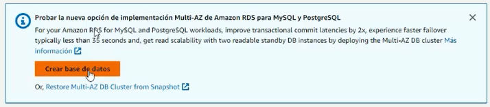
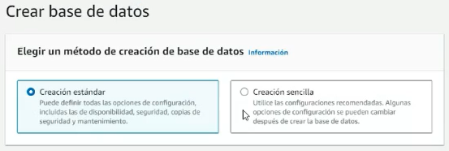
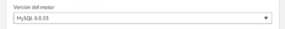
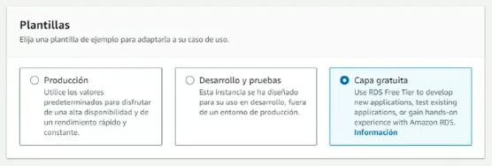
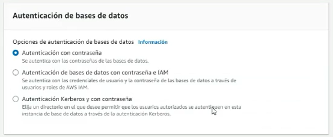
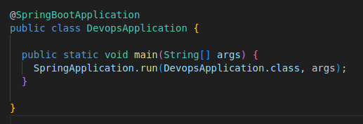

# Proyecto Devops de Kibernum Academy

Este proyecto es una aplicación web de Spring Boot para la gestión de estudiantes.

## Descripción

El proyecto implementa un sistema de gestión de estudiantes que permite las operaciones de creación, lectura, actualización y eliminación (CRUD) de los registros de estudiantes. 

Los estudiantes tienen los siguientes campos:

- ID (generado automáticamente)
- Nombre
- Apellido
- Email (único)

## Instalación

### Prerrequisitos: 

- Java 11
    ```console
    sudo apt update
    sudo apt install openjdk-11-jdk
    java --version
    ```
- Docker
- Git


### Descargar y Desplegar localmente:

```console
git clone 
```

Entra al directorio del proyecto:

```console
cd DevopsTestMerge
```

Para compilar el proyecto y testear utilizando el mvn wrapper

```console
sh mvnw clean package
```

Para ejecutar el proyecto:

```console
cd target/
java -jar devops-0.0.1-SNAPSHOT.jar 
```

## Verificar Despliegue: 

visitar `http://localhost:9090` para comenzar a usar la aplicación.


## Amazon RDS: 
Amazon Relational Database Service (Amazon RDS) es un servicio de bases de datos gestionado y altamente escalable ofrecido por Amazon Web Services (AWS). Diseñado para facilitar el despliegue y la administración de bases de datos relacionales en la nube, Amazon RDS permite a los usuarios configurar, operar y escalar fácilmente distintos motores de bases de datos populares, como MySQL, PostgreSQL, Oracle, SQL Server y otros. Al utilizar Amazon RDS, los usuarios pueden centrarse en el desarrollo de sus aplicaciones y dejar la complejidad de la administración de la infraestructura de bases de datos en manos de AWS. Amazon RDS proporciona características como copias de seguridad automáticas, mantenimiento de software, parches de seguridad y alta disponibilidad, garantizando un rendimiento óptimo y confiable de las bases de datos sin preocupaciones por la gestión de hardware o software subyacente.

1. Ir a la consola de Amazon y buscar RDS: 

2. Seleccionamos Amazon RDS. 

   Vamos donde dice Crear base de datos.
 

3. Creación estándar

    
4. Selecciamos MYSQL. 
   - Versión del motor: MYSQL 8.0.32
   - Edición "Comunidad de MYSQL".
    
    
    
5. En plantillas selecciona "Capa gratuita".

    
6. Configuración "identificador de clúster de base de datos"
    - "db-devops"

7. Configuración de credenciales
    - Nombre de usuario maestro: root 
    - Contraseña: academyjava

8. Clase de Instancia de Base de datos: 
    - Clases con ráfagas (incluye clases t)
    - db.t3.micro

9. Seleccionar acceso público en Conectividad

    
10. Asegurarnos de que este configurado el puerto 3306
    
11. En autenticción: autenticación con contraseña
    
12. Supervisión (dejar default)

13. Opciones de base de datos
    - Nombre: bd-crud
    

### Testear Acceso 

1. Ir al panel principal de RDS y seleccionar la base de datos 
    - Verificar que el estado este "Activo"

2. Buscar punto de enlace y puerto: 
    
3. Configurar Regla de seguridad de ingreso (Inbound)
    - Crear una nueva regla de entrada
    
    - Dar permiso a todo el trafico, Anywhere. 
     
    

4. Configurar Base de datos en el proyecto: 
    - Ver que hemos cambiado la clase principal. Ya no estamos ingresando usuarios por defecto. 
    
    - En application.properties pegar nuestro punto de acceso a la base de datos. 
    
5. Volver a hacer build 
    ```console
    sh mvnw clean package
    ```

6. Podemos acceder de nuevo en localhost: 
    ```console
    cd target/
    java -jar devops-0.0.1-SNAPSHOT.jar 
    ```
    visitar `http://localhost:9090` para comenzar a usar la aplicación.

    Ahora veremos usuarios creados por mockito en el proceso de testing. Pueden revisar clases de test. Ahora la app esta funcionando con la base de datos en Amazon. 

    Esta base de datos tambien se puede usar desde un sistema gestor de base de datos. 


## Instancia EC2 

1. Testear conexión: 
```console
    ssh -i ec2-key.pem ec2-user@ec2-3-96-67-238.ca-central-1.compute.amazonaws.com
```

```console
sudo scp -i /home/bellyster/miguel/cloudwatch/ec2-key.pem ./devops-0.0.1-SNAPSHOT.jar ec2-user@ec2-3-96-67-238.ca-central-1.compute.amazonaws.com:~/.
```

## Contribuciones: 

Cualquier persona que desee contribuir a este proyecto es bienvenida. Las contribuciones no se limitan a la programación. Cualquier ayuda con la documentación, la identificación de errores, las sugerencias o las mejoras en el diseño son igualmente apreciadas. Si deseas contribuir a la codificación, puedes hacer un fork del proyecto y enviar una pull request. No olvides incluir pruebas para tu código.


## Licencia

Proyecto realizado por Miguel. 
Adaptación para ser utilizado en clase de CloudWatch

Este proyecto es de código abierto bajo la licencia [MIT](https://opensource.org/licenses/MIT).

