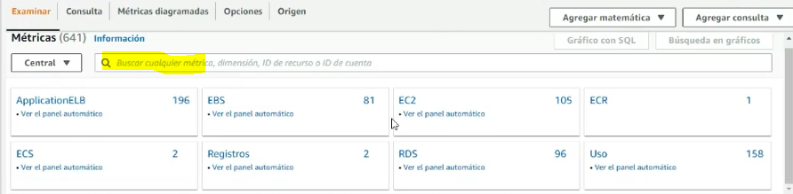

# Proyecto Devops de Kibernum Academy

Este proyecto es una aplicación web de Spring Boot para la gestión de estudiantes.

## Descripción

El proyecto implementa un sistema de gestión de estudiantes que permite las operaciones de creación, lectura, actualización y eliminación (CRUD) de los registros de estudiantes. 

Los estudiantes tienen los siguientes campos:

- ID (generado automáticamente)
- Nombre
- Apellido
- Email (único)

## Instalación

### Prerrequisitos: 

- Java 11
    ```console
    sudo apt update
    sudo apt install openjdk-11-jdk
    java --version
    ```
- Docker
- Git


### Descargar y Desplegar localmente:

```console
git clone 
```

Entra al directorio del proyecto:

```console
cd DevopsTestMerge
```

Para compilar el proyecto y testear utilizando el mvn wrapper

```console
sh mvnw clean package
```

Para ejecutar el proyecto:

```console
cd target/
java -jar devops-0.0.1-SNAPSHOT.jar 
```

## Verificar Despliegue: 

visitar `http://localhost:9090` para comenzar a usar la aplicación.


## Amazon RDS: 
Amazon Relational Database Service (Amazon RDS) es un servicio de bases de datos gestionado y altamente escalable ofrecido por Amazon Web Services (AWS). Diseñado para facilitar el despliegue y la administración de bases de datos relacionales en la nube, Amazon RDS permite a los usuarios configurar, operar y escalar fácilmente distintos motores de bases de datos populares, como MySQL, PostgreSQL, Oracle, SQL Server y otros. Al utilizar Amazon RDS, los usuarios pueden centrarse en el desarrollo de sus aplicaciones y dejar la complejidad de la administración de la infraestructura de bases de datos en manos de AWS. Amazon RDS proporciona características como copias de seguridad automáticas, mantenimiento de software, parches de seguridad y alta disponibilidad, garantizando un rendimiento óptimo y confiable de las bases de datos sin preocupaciones por la gestión de hardware o software subyacente.

1. Ir a la consola de Amazon y buscar RDS: 

2. Seleccionamos Amazon RDS. 

   Vamos donde dice Crear base de datos.
 

3. Creación estándar

    
4. Selecciamos MYSQL. 
   - Versión del motor: MYSQL 8.0.32
   - Edición "Comunidad de MYSQL".
    
    
    
5. En plantillas selecciona "Capa gratuita".

    
6. Configuración "identificador de clúster de base de datos"
    - "db-devops"

7. Configuración de credenciales
    - Nombre de usuario maestro: root 
    - Contraseña: academyjava

8. Clase de Instancia de Base de datos: 
    - Clases con ráfagas (incluye clases t)
    - db.t3.micro

9. Seleccionar acceso público en Conectividad

    
10. Asegurarnos de que este configurado el puerto 3306
    
11. En autenticción: autenticación con contraseña
    
12. Supervisión (dejar default)

13. Opciones de base de datos
    - Nombre: bd-crud
    

### Testear Acceso 
1. Ir al panel principal de RDS y seleccionar la base de datos 
    - Verificar que el estado este "Activo"

2. Buscar punto de enlace y puerto: 
    
3. Configurar Regla de seguridad de ingreso (Inbound)
    - Crear una nueva regla de entrada
    
    - Dar permiso a todo el trafico, Anywhere. 
     
    

4. Configurar Base de datos en el proyecto: 
    - Ver que hemos cambiado la clase principal. Ya no estamos ingresando usuarios por defecto. 
    
    - En application.properties pegar nuestro punto de acceso a la base de datos. 
    
5. Volver a hacer build 
    ```console
    sh mvnw clean packag
    ```

6. Podemos acceder de nuevo en localhost: 
    ```console
    cd target/
    java -jar devops-0.0.1-SNAPSHOT.jar 
    ```
    visitar `http://localhost:9090` para comenzar a usar la aplicación.

    Ahora veremos usuarios creados por mockito en el proceso de testing. Pueden revisar clases de test. Ahora la app esta funcionando con la base de datos en Amazon. 

    Esta base de datos tambien se puede usar desde un sistema gestor de base de datos. 


## Instancia EC2 

1. Ir a EC2 y Lanzar instancia

    

2. Dar de nombre proyectoDevops

    

3. Seleccionar Amazon Linux de tipo SSD (Apta para capa gratuita)

    

4. Tipo de instancia t2 micro

    

5. Par de claves, crear un nuevo par de claves y guardar el archivo PEM que nos ayudará a conectarnos. 

    

    
    
6. Poner el archivo ec2-key.pem en el directorio raíz del proyecto. 
(donde esta el readme.md)

### Abrir puerto de la aplicación:

1. Ir a la intancia y bajar a seguridad. 

2. Seleccionar el grupo de seguridad. 

3. Crear una nueva regla 


### Testear conexión
1. Ver la instancia, tome nota de la dirección DNS IPv4

2. Testear conexión (unicandose en el directorio raíz del proyecto donde esta el archivo pem): 

    - construir string: ssh -i [PEMKEY.PEM] ec2-user@[DNS_IPv4ADDRESS]
```console
    ssh -i ec2-key.pem ec2-user@ec2-3-96-67-238.ca-central-1.compute.amazonaws.com
```

### Instalar dependencias en EC2 

Debemos estar conectados a la consola EC2 con el comando anterior. 
1. Instalar JDK-11: https://docs.aws.amazon.com/corretto/latest/corretto-20-ug/generic-linux-install.html#rpm-linux-install-instruct

```sh
 sudo rpm --import https://yum.corretto.aws/corretto.key
```

```sh
 sudo curl -L -o /etc/yum.repos.d/corretto.repo https://yum.corretto.aws/corretto.repo
```

- Instalamos la version 11

```sh 

sudo yum search corretto
```

```sh
sudo yum install -y java-11-amazon-corretto-devel
```

```sh
java -version
```

2. Subir Proyecto (TARGET)
    - Ubicarnos en la ruta donde esta el .jar 
    - sudo scp -i [RUTA-ABSOLUTA-PEM] ./devops-0.0.1-SNAPSHOT.jar ec2-user@[DNS_IPv4ADDRESS]:~/.

```console
sudo scp -i /home/bellyster/miguel/cloudwatch/ec2-key.pem ./devops-0.0.1-SNAPSHOT.jar ec2-user@ec2-3-96-67-238.ca-central-1.compute.amazonaws.com:~/.
```

## Desplegamos aplicación: 
Entrar desde el directorio raíz con la misma ruta que lo hicimos anteriormente. 

construir string: ssh -i [PEMKEY.PEM] ec2-user@[DNS_IPv4ADDRESS]
```console
    ssh -i ec2-key.pem ec2-user@ec2-3-96-67-238.ca-central-1.compute.amazonaws.com
```
AL hacer ls: deberiamos ver el jar. 

### primer plano 


```sh
java -jar devops-0.0.1-SNAPSHOT.jar
```
[DNS-IPV4]:9090/login

```sh
lsof -n -i4TCP:9090
```
```sh
kill -9 "PID" (matamos el proceso)
lsof -n -i4TCP:9090
```

### Para que se ejecute en background 
```sh
screen -d -m java -jar "nombredeljar"
 ```
```
screen -r y control c (matamos todo)
```
http://ec2-3-23-98-199s-east-2.compute.amazonaws.com:9090

usuario: userdevops

contraseña: devops


## CLOUDWATCH
Amazon CloudWatch es un servicio de monitoreo y observabilidad de Amazon Web Services (AWS) que permite supervisar y rastrear en tiempo real métricas, registros y eventos de los recursos y aplicaciones en la nube de AWS. Proporciona alertas configurables para eventos críticos y facilita el análisis y almacenamiento de registros para el seguimiento detallado de aplicaciones y sistemas. CloudWatch es esencial para garantizar la fiabilidad y rendimiento de las aplicaciones en AWS, brindando una visibilidad completa y una plataforma centralizada de supervisión y análisis.
Esta funcionalidad de Amazon permite hacer 3 paneles en la capa gratuita. 

1. Ir a cloudwatch 


2. Dar click en "Panel" (menu izquierdo)


3. Crear un nuevo panel


4. No agregar ningun widget al inicio. 
5. Paneles: Ahora veremos el panel que creamos. 
6. Ir a paneles automaticos: Seleccionar EC2. 


7. Y veremos un panel ya configurado para monitorear EC2. 

8. Añadir al panel: Añade el panel automatico a nuestro panel. 

Eliminamos el panel seleccionandolo y eliminandolo. Y luego creamos un nuevo panel con el mismo nombre. 

1. Crear nuevo panel y entrar. 
2. El el menpu izquierdo selecionar Metricas > Todas las metricas. Aquí podemos ver todas las métricas que hemos utilizado hasta el momento. 



3. Aplicar los filtros: cpu, ec2 

4. Seleccionamos ec2 por instancia. Y veremos un listado de todas las instancias que hemos levantado (incluendo las que hicimos con terraform antes) Debemos buscar en el listado (al final) proyecto devops y seleccionar "Cpu Utilization"


5. Ahora que seleccionamos el origen, debemos dar click a la tab "metricas diagramadas" 
Podemos cambiar el nombre del gráfico, la estadistica considerada o el periodo, etc. 

6. Arriba del gráfico, a la derecha de las horas, se puede cambiar el tipo de gráfico. Línea esta seleccionado por default. 

7. Finalmente, en Acciones se puede añadir al panel. Y tenemos nuestro primer gráfico. 

8. Arriba en el más (extremo derecho), podemos añadir un segundo panel. Podemos filtrar ahora network y EC2.  


9. Seleccionar nuestro proyecto entrada/salida

10. Se puede editar también las etiquetas 


11. Seleccionar número y aplicar. 

## Configurar Agente

Conectarse a instancia EC2. Cómo lo habiamos echo antes. 
Dentro de la instancia instalamos un agente: 

1. Instalar el agente
 ```sh
 sudo yum install amazon-cloudwatch-agent
 ```
2. Verificar instalación. 
 ```sh
cd /opt/aws
cd amazon-cloudwatch-agent
ls -l
cd bin
ls
```

Aquí veremos un wizard! que debemos ejecutar como administradores. 

3. Ejecutar el wizard: 
```sh
 sudo ./amazon-cloudwatch-agent-config-wizard
```

Opciones: 
- seleccionamos 1 (linux)
- seleccionamos 1 (ec2)
- seleccionamos 1 (root)
- seleccioanmos 1 (do you maint to turn on StatsD deamon? 1. yes)
- Which port do you want StatsD daemon to listen to?
default choice: [8125] (enter)
- What is the collect interval for StatsD daemon?
    * seleccionamos 1 (10s)
- What is the aggregation interval for metrics collected by StatsD daemon?
    * seleccionamos 4 (60s)
- Do you want to monitor metrics from CollectD? WARNING: CollectD must be installed or the Agent will fail to start
    * seleccionamos 1(yes)
- Do you want to monitor any host metrics? e.g. CPU, memory, etc.
    * seleccionamos 1(yes)
- Do you want to monitor cpu metrics per core?
    * seleccionamos 1(yes)
- Do you want to add ec2 dimensions (ImageId, InstanceId, InstanceType, AutoScalingGroupName) into all of your metrics if the info is available?
    * seleccionamos 1(yes)
- Would you like to collect your metrics at high resolution (sub-minute resolution)? This enables sub-minute resolution for all metrics, but you can customize for specific metrics in the output json file.
    * Seleccionamos 4 (60 segundos)
- Which default metrics config do you want?
    * Standard (seleccionamos 2 - no DEFAULT)
- Estamos satisfechos? 
    * seleccionamos 1 (yes)
- Tenemos ya un agente? 
    * Seleccionamos 2 (no)
- Do you want to monitor any log files?
    * seleccionamos 1 (yes)
- Log file path: /var/log/httpd/*
- Log group name: servidor-log-devops 
- Log stream name: servidor-devops
- Log Group Retention in days (tiempo de retención)
    * Seleccionamos 3 (3 dias)
- Do you want to specify any additional log files to monitor?
    * Seleccionamos 2 (no)
- Do you want to store the config in the SSM parameter store?
    * Seleccionamos 2 (no)

Listo, el programa se ha creado. AL ejecutar ls veremos un archivo: 

config.json

Editar este archivo modificando la sección mem, usando VI (con sudo).

```json
"mem": {
        "measurement": [
                "mem_used_percent"
        ],
        "metrics_collection_interval": 60
},
```
Añadir las tres opciones que se muestran
```json
"mem": {
        "measurement": [
                "mem_used_percent",
                "mem_free",
                "mem_used",
                "mem_total"
        ],
        "metrics_collection_interval": 60
},
```

###  Crear un ROL para el agente en EC2

1. IAM -> ROLE s-> "CREAR ROL "- > AWS SERVICE (Servicio de AWS) -> CASO DE USO COMUNES (tipo EC2) 

2. Agregar permisos: Buscar CloudWatch -> (hacemos ticket en CloudwatchAgentServerPolicy)

3. Detalles del rol: 
    - role name: agente-devops-cw
    - descriptcion: llamar a cloudwatch

4. Finalizar

en roles buscamos y deberiamos ver nuestro rol

5. Ir a la Instancia en EC2. 

6. Seleccionar pestaña superior ACCIONES -> Seguridad -> Modificar rol de IAM

7. Seleccionar rol - debe aparecer el agente 
Una vez creado al hacer click en la instancia veremos el rol en la sección de seguridad. 

### Arrancar el agente 

Debemos estar dentro de la instancia de aws. 

1. Instalar collectd

```sh 
sudo amazon-linux-extras install collectd
```

2. Iniciar agente: 

```sh
sudo /opt/aws/amazon-cloudwatch-agent/bin/amazon-cloudwatch-agent-ctl -a fetch-config -m ec2 -s -c file:/opt/aws/amazon-cloudwatch-agent/bin/config.json
```

3. Verificar status: 

```sh
systemctl status amazon-cloudwatch-agent.service
```
### Consumir metricas del agente: 

1. Ir al panel de cloudwatch y entrar a nuestro panel. 
2. Crear un nuevo widget de linea, y ahora veremos CW Agent con nuestras nuevas métricas. :D

## Crear Alertas: 

Crear un nuevo tema SNS (SNS Topic) en Amazon Web Services es un proceso bastante directo. Aquí te muestro cómo hacerlo paso a paso:

1. Inicia sesión en tu cuenta de AWS y ve al AWS Management Console.

2. En el menú de servicios, busca "SNS" o "Simple Notification Service" y haz clic en él.

3. Una vez en el panel de SNS, haz clic en "Topics" en el menú de la izquierda.

4. Luego, haz clic en "Create topic".

5. En el formulario que aparece, tendrás que rellenar la información necesaria:

   - **Type**: Elige "Standard" si deseas que las suscripciones reciban todos los mensajes en el orden en que se publicaron o "FIFO" si deseas que las suscripciones reciban los mensajes en el orden en que se publicaron y no recibir mensajes duplicados.

   - **Name**: Escribe el nombre que quieres para tu tema.

   - **Display name**: (Opcional) Escribe un nombre que se mostrará en las notificaciones.

6. Puedes dejar las demás opciones en sus valores predeterminados, a menos que tengas requisitos específicos.

7. Una vez que hayas completado los detalles, haz clic en "Create Topic".

¡Eso es todo! Ahora deberías tener un nuevo tema SNS en tu cuenta de AWS que puedes utilizar para tus necesidades de notificación. Recuerda que necesitarás suscribirte a este tema para empezar a recibir notificaciones.


Una vez que hayas creado tu Topic en Amazon SNS, puedes suscribir una dirección de correo electrónico a ese Topic siguiendo estos pasos:

1. Navega hasta el panel de AWS Simple Notification Service (SNS) en la consola de AWS.

2. En el menú de navegación de la izquierda, haz clic en "Topics".

3. Encuentra y selecciona el Topic al que deseas suscribir tu dirección de correo electrónico.

4. En la página de detalles del Topic, selecciona "Create subscription" en la sección "Subscriptions".

5. En el menú desplegable para el "Protocol", selecciona "Email".

6. En el campo "Endpoint", introduce la dirección de correo electrónico que deseas suscribir.

7. Haz clic en "Create subscription".

Después de estos pasos, AWS enviará un correo electrónico al "Endpoint" que has proporcionado para confirmar la suscripción. Necesitas abrir ese correo electrónico y hacer clic en el enlace de confirmación para activar la suscripción. Solo después de confirmar, comenzarás a recibir notificaciones por correo electrónico para los mensajes publicados en ese Topic.


Parece que ya has llegado a la página de "Crear una suscripción" en la consola AWS para Amazon SNS. Aquí te explico cómo completar el proceso de suscribir un correo electrónico a tu Topic:
s
1. En el campo **ARN del tema**, ya tienes prellenado el ARN (Amazon Resource Name), que es un identificador único para tu SNS Topic.

2. En el campo **Protocolo**, selecciona "Email" en el menú desplegable. Esto indica que quieres que las notificaciones se envíen por correo electrónico.

3. Aparecerá un nuevo campo llamado **Dirección de correo electrónico**. Aquí es donde debes introducir la dirección de correo electrónico a la que quieres que se envíen las notificaciones.

4. La **Política de filtro de suscripciones** es opcional y puedes usarla para filtrar los mensajes que recibe el suscriptor. Si no necesitas un filtro específico, puedes dejar esto en blanco.

5. La **Política de redireccionamiento (cola de mensajes fallidos)** también es opcional y permite redirigir los mensajes que no se pueden entregar a una "cola de mensajes fallidos". Si no tienes una configuración específica para manejar mensajes fallidos, puedes dejar esto en blanco.

6. Haz clic en "Crear suscripción" para finalizar el proceso.

Una vez que hayas completado estos pasos, AWS enviará un correo electrónico al correo electrónico proporcionado para confirmar la suscripción. Deberás abrir ese correo electrónico y hacer clic en el enlace de confirmación para activar la suscripción. Una vez confirmado, comenzarás a recibir notificaciones por correo electrónico para los mensajes publicados en el Topic de SNS.


## Contribuciones: 

Cualquier persona que desee contribuir a este proyecto es bienvenida. Las contribuciones no se limitan a la programación. Cualquier ayuda con la documentación, la identificación de errores, las sugerencias o las mejoras en el diseño son igualmente apreciadas. Si deseas contribuir a la codificación, puedes hacer un fork del proyecto y enviar una pull request. No olvides incluir pruebas para tu código.


## Licencia

Proyecto realizado por Miguel. 
Adaptación para ser utilizado en clase de CloudWatch

Este proyecto es de código abierto bajo la licencia [MIT](https://opensource.org/licenses/MIT).

